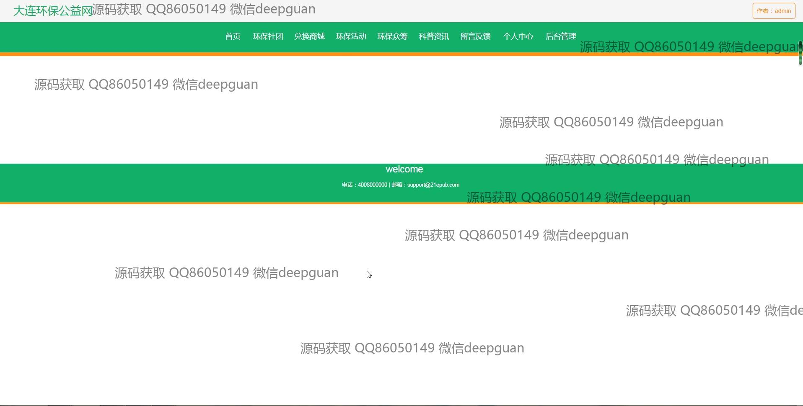
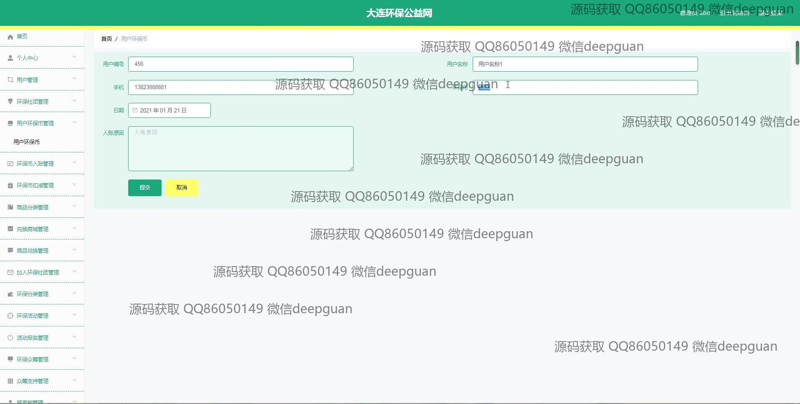
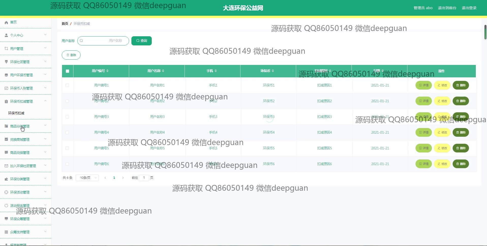

<h1 align="center">大连环保公益网vue</h1>

## 简介
大连环保公益网：角色分为管理员、用户；提供个人信息管理、环保活动管理、环保币管理、商品兑换、环保社团管理等功能模块，支持用户信息维护与环保项目参与。    --计算机毕业设计源码；毕设源码；java毕业设计源码

## 联系方式

<h3 align="center">获取完整代码与数据库文件 + 微信：deepguan QQ: 86050149 QQ群: 783742310</h3>

<h3 align="center">可帮忙远程部署 包运行成功！提供远程部署、修改代码、设计文档指导、代码讲解等服务！</h3>

## 功能介绍（完整见运行截图）
管理员：支持用户信息管理，包括新增、修改和删除操作；管理环保活动、环保项目及商品分类；通过表单录入商品信息、活动信息及环保币管理；提供对众筹项目、环保文章、社团成员的管理功能；界面简洁，支持信息搜索、筛选及快速操作。

用户：可注册、登录、编辑个人信息，支持上传头像；访问个人中心查看和修改环保币及订单信息；参与环保活动及社团管理；浏览环保资讯、兑换商城和留言反馈；支持活动报名信息查看和文档上传，操作便捷高效。

访客：访问网站首页，通过导航栏快速进入各模块；浏览环保众筹项目、科普资讯及环保商城；查看扶贫政策及自然风光展示；可通过联系信息反馈意见，提升体验。

开发者：系统采用Vue框架开发，模块化设计清晰，支持文件上传、富文本编辑及分页查询；界面采用简洁主题，导航流畅；管理员和用户权限分离，功能丰富，增强管理和使用效率。

## 运行截图

本代码来源于网络,仅供学习参考使用!

